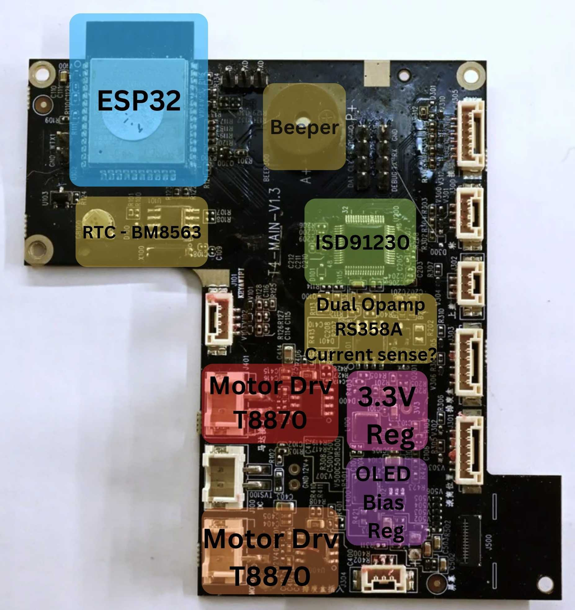
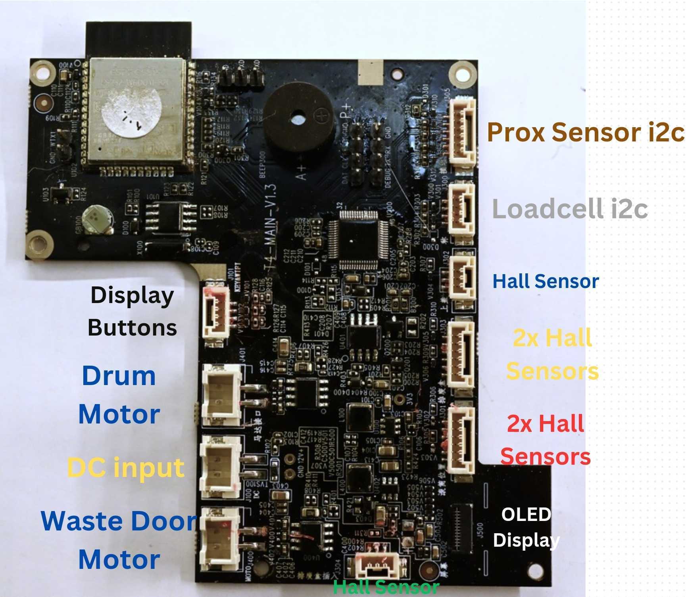

# Main Board Overview

## Interfaces

## ESP32 Pinout Table

| ESP32 GPIO    | Package Pin Num | Function    | Strapping Function | Notes                                          |
| ------------- | ----------------------- | ----------- | ------------------ | ---------------------------------------------- |
| GPIO_0 | 25  | User Button "OK" | Bootloader Entry |  |
| GPIO_1 | 35  | UART0 - TX, MCU bus, bootloader |  |  |
| GPIO_2 | 24  | OLED Bias Regulator Enable | Bootloader Entry |  |
| GPIO_3 | 34  | UART0 - RX, MCU bus, bootloader |  |  |
| GPIO_4 | 26  | I2C - SCL |  | Bus used for RTC |
| GPIO_5 | 29  | OLED SPI - CS | SDIO Timing |  |
| GPIO_6 | 20  | Internal flash ROM use only |  |  |
| GPIO_7 | 21  | Internal flash ROM use only |  |  |
| GPIO_8 | 22  | Internal flash ROM use only |  |  |
| GPIO_9 | 17  | Internal flash ROM use only |  |  |
| GPIO_10 | 18 | Internal flash ROM use only |  |  |
| GPIO_11 | 19 | Internal flash ROM use only |  |  |
| GPIO_12 | 14 | No Connect? | Internal LDO voltage select |  |
| GPIO_13 | 16 | Beeper |  |  |
| GPIO_14 | 17 | No Connect? |  |  |
| GPIO_15 | 23 | I2C - SDA | Enable boot log uart0, SDIO timing | Bus used for RTC |
| GPIO_16 | 27 |  |  |  |
| GPIO_17 | 28 | OLED RESET |  |  |
| GPIO_18 | 30 | OLED SPI - SCK |  |  |
| GPIO_19 | 31 | OLED DC |  |  |
| GPIO_21 | 33 |  |  |  |
| GPIO_22 | 36 |  |  |  |
| GPIO_23 | 37 | OLED SPI - MOSI |  |  |
| GPIO_25 | 10 | UART1 - TX, Debug serial log |  |  |
| GPIO_26 | 11 | "3V3_D" power domain enable |  | Seems to be used mainly for powering hall sensors? |
| GPIO_27 | 12 | No Connect? |  |  |
| GPIO_32 | 8  | 3.3V rail measurement? |  |  |
| GPIO_33 | 9  | No Connect? |  |  |
| GPIO_34 | 6  | User Button "Menu"  |  | Input Only |
| GPIO_35 | 7  |  |  | Input Only |
| GPIO_36 | 4  |  |  | Input Only |
| GPIO_39 | 5  |  |  | Input Only |
